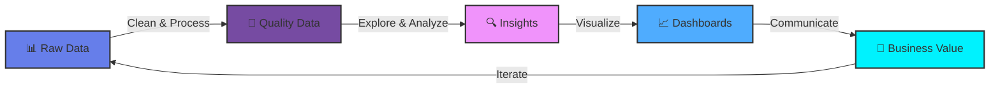

  
  
  

    

  

 

---

<table>
<tr>

<td width="50%" valign="top">

<h2>👋 About Me</h2>

<strong>Name:</strong> Mehwish Akram 
<strong>Role:</strong> Data Analyst 
<strong>Location:</strong> Bahrain 🇧🇭 
<strong>Motto:</strong> Turning Coffee ☕ Into Code & Data Into Insights 📊

<h3>🎯 Mission</h3>

Transform complex data into clear, actionable insights that drive business decisions and create value.

<h3>💼 Experience</h3>
<ul>
  <li>Data Analytics: 0–1 Years (Growing expertise)</li>
  <li>Teaching: 6+ Years (Education, mentoring & instruction)</li>
</ul>

<h3>📜 Certifications</h3>
<ul>
  <li>ISO/IEC 27001:2022 Lead Auditor — Mastermind Institute </li>
  <li>AWS Educate: Introduction to Generative AI </li>
  <li>Google IT Support Professional Certificate — Coursera </li>
  <li>Foundations of Project Management — Coursera </li>
  <li>Diploma in Digital Marketing — OBH Institute </li>
 
</ul>

<h3>🚀 Status</h3>
<ul>
  <li>Learning: Data Engineering</li>
  <li>Interested In: AI, Business Intelligence, Analytics</li>
  <li>Looking For: Collaboration, New Opportunities</li>
</ul>

</td>

<td width="50%" valign="top" align="center">

  

</td>

</tr>
</table>
---

  
### 🎨 My Data Analytics Journey

<i>The continuous cycle of data-driven decision making</i>

---

## 🛠️ Tech Stack & Tools

### 💻 Programming Languages

  

### 📊 Data & Analytics

<table>
  <tr>
    <td align="center" width="25%">
      <h4>Analysis</h4>
       
       
      
    </td>
    <td align="center" width="25%">
      <h4>Visualization</h4>
       
       
      
    </td>
    <td align="center" width="25%">
      <h4>Databases</h4>
       
       
      
    </td>
    <td align="center" width="25%">
      <h4>Data Eng</h4>
       
       
      
    </td>
  </tr>
</table>

### 🧰 Development Tools

  

  
  
  
  
  
  
  
  
  

---

## 💬 Inspirational Quote

  

---

# 🏆 Achievements & Certifications

### 🎓 Professional Certifications

 

<table>
  <tr>
    <td align="center">
       
    </td>
  </tr>
  <tr>
    <td align="center">
       
        
        
      <h3>🌟 Certified Professional</h3>
      

        <i>Click below to explore my complete certification portfolio</i>
      

       
      
    </td>
  </tr>
</table>

 

---

  

 

  

**⭐ If you like what you see, consider starring this repository! ⭐**

 

<!-- 
  STAR BUTTON
  Clicking this button takes the user directly to the repository page on GitHub.
  GitHub does not allow starring a repo from outside the platform (requires user login and authentication).
  The best approach is to redirect users to the repo page so they can star it themselves.
-->

 

<!-- 
  STAR COUNT BADGE
  Uses shields.io to fetch the real-time star count from the GitHub API.
  The "social" style shows the count even when it is zero (avoids "INVALID" label).
  Clicking the badge opens the stargazers page of the repository.
-->

Last Updated: April 2026 • Made by Mehwish A. Mughal 

**💡 Remember:** *"The best way to predict the future is to analyze the data."* 📊✨

